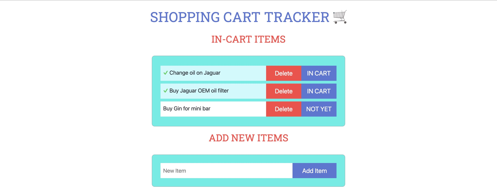

# SHOPPING LIST 

### FEATURE 1

* ALLOWS USER TO TRACK ITEMS FOR FUTURE PURCHASE.  THIS CAN BE FOOD, CLOTHES, OR EVEN TASKS THAT NEED TO BE COMPLETED IN THAT DAY.
* THIS IS DONE WITH PURE JAVASCRIPT, HTML, AND CSS.  VERY LITTLE BOOTSTRAP WAS USED.
* ONCE THE ITEM IS ADDED TO THE CART IF CAN BE FURTHER TOGGLED TO INDICATE IS HAS BEEN RETRIEVED OR COMPLETED.

### FEATURE 2 

* SHOWS THE WEATHER FOR THAT DAY.  
* THIS IS DONE BY USING AN API THROUGH [openweathermap.org](https://openweathermap.org/)
* IT ALLOWS YOU TO CHECK THE CITY YOU ARE CURRENTLY IN.  IT'S GOOD TO KNOW THE WEATHER WHEN RUNNING ERRANDS, SO YOU ARE PREPARED FOR UNFORESEEN EVENTS.

### FEATURE 3 

* FOR THE LAST FEATURE I ADDED A CALCULATOR.  FOR SOMEONE THAT IS ON A BUDGET OR LIKES TO BUDGET SUCH AS MYSELF.  IT IS NECESSARY TO CALCULATE YOUR TOTAL EXPENSES TO REMAIN WITHIN YOUR BUDGET.  
* IT IS A FULLY FUNCTIONAL CALCULATOR.  WITH ALL THE OPERATORS NEEDED TO SUBTRACT, ADD, DIVIDE, AND MULTIPLY.

FUTURE FEATURES

* ABILITY TO EDIT SHOPPING CART LIST.
* MOBILE SIZING FRIENDLY - ADD MEDIA QUERIES.
* POSSIBLY MAKE IN REACT NATIVE.  FOR FULL MOBILE CAPABILITIES.